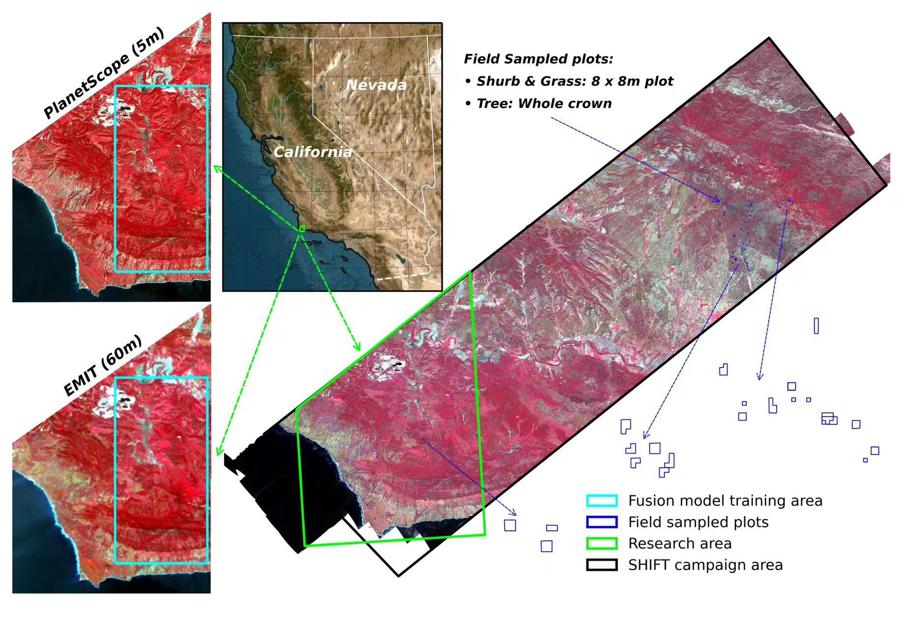
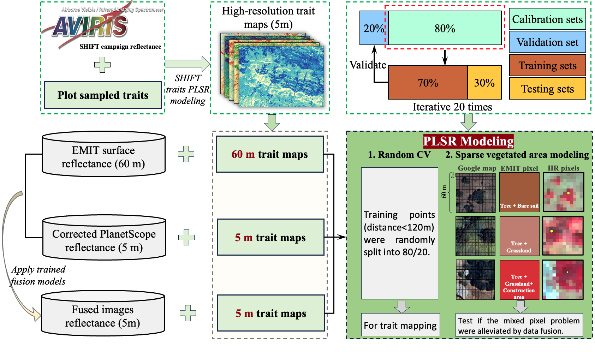

# Assessing the suitability of reconstructed high-resolution hyperspectral imagery from PlanetScope and EMIT for plant functional trait estimation

Fujiang Ji <sup>a</sup>, Ting Zheng <sup>a</sup>, Philip A. Townsend <sup>a</sup>, Ming Liu <sup>b</sup>, Min Chen <sup>a</sup>  


<sup>a</sup> Department of Forest and Wildlife Ecology, University of Wisconsin-Madison, Madison, WI, 53706, USA  
<sup>b</sup> Department of Computer Sciences, University of Wisconsin-Madison, Madison, WI, 53706, USA

## Summary
* Quantifying plant functional traits at fine spatial scales is essential for advancing ecosystem monitoring, biodiversity assessment, and Earth system modeling. However, current satellite sensors often face a trade-off between capturing detailed spectral information and fine spatial resolution. To address this, data fusion approaches that integrate hyperspectral and multispectral imagery have been developed to reconstruct high-resolution hyperspectral imagery (HR-HSI). 
* While these fused products have shown promise in applications such as land cover classification, their utility for accurate trait estimation based on the reconstructed spectra has remained underexplored. In this study, we evaluated the capability of deep learning-based fusion models to reconstruct HR-HSI using spaceborne multispectral (PlanetScope) and hyperspectral (NASA’s EMIT) inputs and assessed their effectiveness for large-scale estimation of 14 plant functional traits. 
* Benchmarking against AVIRIS-NG-derived trait maps from the SHIFT campaign, we found that fused HR-HSI substantially improved trait estimation compared to multispectral imagery alone, achieving higher validation R2 values ranging from 0.143 to 0.522 across traits. Although trait estimates from fused HR-HSI were slightly less accurate than those based on native EMIT reflectance, with reductions in R2 ranging from 0.092 to 0.197 and NRMSE increases of 0.7% to 3.1%, they captured finer spatial variability and better matched the spatial patterns observed in the benchmark trait maps. 
* Importantly, incorporating trait-specific spectral guidance into the fusion training further enhanced performance, particularly for traits with key absorption features in the shortwave infrared (SWIR) region.
* Nevertheless, limitations remain. The quality of reconstructed HR-HSI is sensitive to sensor noise, the absence of SWIR bands in high-resolution inputs, and domain shifts between training and application areas, all of which can introduce reconstruction artifacts and reduce trait prediction accuracy. Users should therefore interpret fused trait maps with caution, especially in regions where spectral reconstruction may be unreliable. Our findings support the feasibility of combining global spaceborne hyperspectral missions with commercial high-resolution multispectral satellites to produce ecologically meaningful HR-HSI products, enabling robust and scalable functional trait mapping at landscape and global scales.

* **Objectives:**
  * **_(1) To what extent does the reconstructed HR-HSI imagery improve plant functional trait estimates across a range of traits, compared to original low spatial resolution hyperspectral (EMIT) and high spatial resolution multispectral (PlanetScope) inputs?_**
  * **_(2) To what extent does incorporating trait-specific spectral absorption features into the training of fusion models influence the reconstruction quality of HR-HSI and the subsequent plant functional trait estimates?_** 


## Study area
<div align="center">
  
  <p><b>Fig. 1.</b> Overview of the research area within the NASA’s SHIFT campaign region in Santa Barbara County, California.</p>
</div>

## Plant Functional Trait Estimation

### Requirements
* Python 3.8.20 and more in [`environment.yml`](environment.yml)

### Usage

* **Clone this repository and set environment**

  ```
  git clone https://github.com/FujiangJi/SmallSat_trait_estimation.git
  conda env create -f environment.yml
  conda activate py38
  ```
### Workflows
<div align="center">
  
  <p><b>Fig. 2.</b> Summarized workflow for plant functional trait estimation.</p>
</div>


### Step 1: Applying the trained fusion models to EMIT and PlanetScope data.
* Navigate to the directory src_code and execute the code [1_imagery_processing.ipynb](src_code/1_imagery_processing.ipynb) cell by cell.
* Original fusion models training code, refer to repository [SmallSat_hyperspectral_reconstruction](https://github.com/FujiangJi/SmallSat_hyperspectral_reconstruction)

### Step 2: Extract training samples.
* For Ranmom cross validation training samples: [2_1_trait_maps_processing.ipynb](src_code/2_1_trait_maps_processing.ipynb)
* For sparse vegetated areas modeling: [2_2_extract_sparse_vegetated_areas.ipynb](src_code/2_2_extract_sparse_vegetated_areas.ipynb)

### Step 3: Training and validating trait estimation models.

* Randon CV training: [3_PLSR_random_modeling.py](src_code/3_PLSR_random_modeling.py)
* Apply the trained trait models to generate trait maps: [4_apply_random_trait_models.py](src_code/4_apply_random_trait_models.py)
* Sparse vegetated areas modeling: [5_PLSR_sparse_vege_modeling.py](src_code/5_PLSR_sparse_vege_modeling.py)
  
## Datasets
* The estimated spaceborne and fused HR-HSI-derived plant functional traits can be found through **[Hugging Face 🤗](https://huggingface.co/datasets/FujiangJi/SHIFT-Plant_functional_traits_spaceborne-derived) _After accepted by a scientific journal_**.

## Reference
In case you use our framework and code in your research, Please cite our paper:
* If you have any questions, please feel free to reach me at fujiang.ji@wisc.edu.
  ```
  Ji, F.; Zheng, T.; Townsend, P. A.;  Liu, M.; Chen, M. Assessing the suitability of reconstructed high-resolution hyperspectral imagery from PlanetScope and EMIT for plant functional trait estimation. 2025. (Manuscript submitted, DOI forthcoming).
  ```

## Contact
```
fujiang.ji@wisc.edu
min.chen@wisc.edu
```
## Credits
* This study is supported by the National Aeronautics and Space Administration (NASA) through Commercial SmallSat Data Scientific Analysis (CSDSA).
* We acknowledge high-performance computing support from the Department of Computer Sciences at UW-Madison. 
